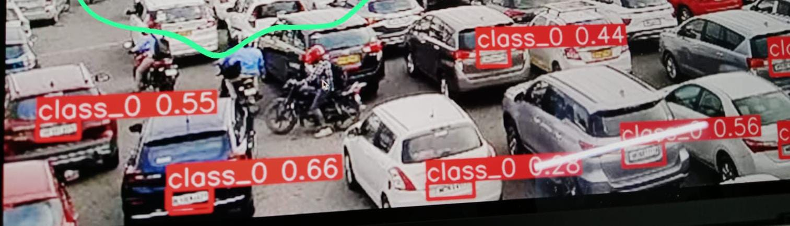

# ANPR: Automatic Number Plate Recognition using YOLOv8


A deep learning-based ANPR system built and trained from scratch on a **custom Indian road dataset** for robust number plate detection using **YOLOv8**.

---

## 🚀 Highlights

* 📸 **Custom Dataset**: 700+ images captured on Indian roads with varying lighting, occlusion, and angles.
* 🏧 **Annotation**: Annotated using [LabelImg](https://github.com/tzutalin/labelImg) in YOLO format.
* 🧠 **Model**: YOLOv8 trained from scratch.
* 📊 **High Performance**: Strong evaluation metrics on the test set.

---

## 📂 Project Structure

```
ANPR/
├── dataset/
│   ├── images/
│   ├── labels/
│   └── ...
├── runs/
│   └── detect/
├── results.csv            # Evaluation metrics
├── yolov8_train.py        # Training script
├── inference.py           # Inference pipeline
├── requirements.txt
└── README.md
```

---

## 🗾 Dataset

* **Total Images**: 700+
* **Annotations**: YOLO format via LabelImg
* **Conditions**: Includes diverse road scenarios from Indian streets

---

## 🏋️‍♂️ Training

* **Model**: YOLOv8n / YOLOv8s
* **Epochs**: 100
* **Image Size**: 640x640
* **Framework**: Ultralytics YOLOv8

```bash
yolo task=detect mode=train model=yolov8n.yaml data=data.yaml epochs=100 imgsz=640
```

---

## 📈 Evaluation

Evaluation metrics from `results.csv`:

| Metric            | Value |
| ----------------- | ----- |
| **mAP\@0.5**      | 0.957 |
| **mAP\@0.5:0.95** | 0.780 |
| **Precision**     | 0.963 |
| **Recall**        | 0.947 |
| **F1 Score**      | 0.955 |

> Evaluated on a separate test set.

---

## 🧪 Inference

Run inference on an image:

```bash
yolo task=detect mode=predict model=best.pt source='path/to/image.jpg'
```

### 🔍 Output Preview

#### Detected Plates



---

## 🔧 Requirements

```bash
pip install -r requirements.txt
```

* Python 3.8+
* OpenCV
* Ultralytics
* PyTorch

---

## 📌 TODO

* [ ] Add OCR for license plate text recognition
* [ ] Streamlit Web UI
* [ ] Real-time video tracking support

---

## 📃 License

Licensed under the [MIT License](LICENSE).

---

## 🙌 Acknowledgements

* [Ultralytics YOLOv8](https://github.com/ultralytics/ultralytics)
* [LabelImg](https://github.com/tzutalin/labelImg)
